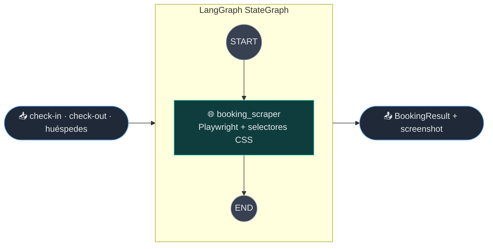
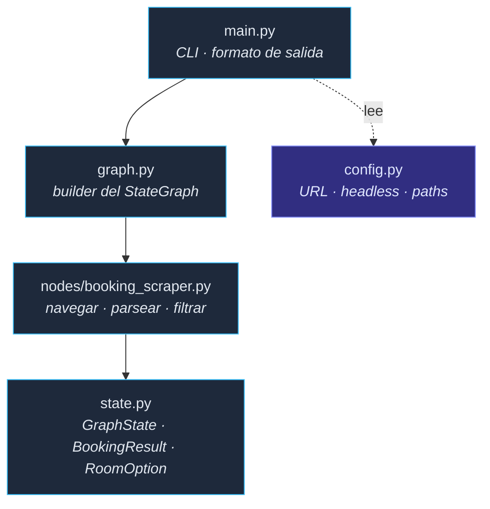
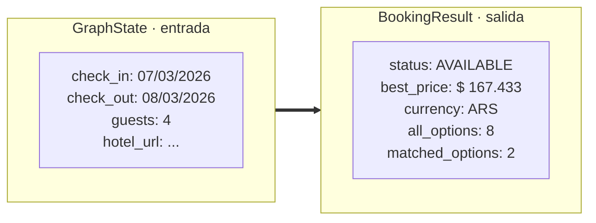

<div align="center">

# 🏨 Agente-Book

### Auditor de precios de Booking.com — un agente LangGraph determinista

**Extrae el precio *correcto* según la cantidad de huéspedes, clasifica la disponibilidad y guarda evidencia visual — en ~10 s, 100% local, $0 de API.**

[](https://python.org)
[](https://playwright.dev)
[](https://github.com/langchain-ai/langgraph)
[](https://docs.pydantic.dev)
[](LICENSE)

[English](README.md) · **Español**

</div>

---

## Por qué existe

Los hoteles independientes viven o mueren según su precio frente a la competencia, pero Booking.com no le da al dueño **ninguna forma simple de monitorear las tarifas en vivo de un rival** para una fecha y cantidad de huéspedes concreta. Hacerlo a mano implica abrir el sitio, elegir fechas, contar cuántas personas duerme cada habitación y leer el precio de la tabla — todos los días.

Agente-Book automatiza esa auditoría. Apuntalo a cualquier propiedad de Booking.com y devuelve un resultado estructurado y accionable: el mejor precio **para la cantidad de huéspedes pedida** (no el engañoso "desde $X"), todas las opciones de habitación, el estado de disponibilidad y un screenshot con timestamp como prueba.

Empezó como un agente LLM de navegación y fue **re-diseñado deliberadamente** como scraper determinista cuando la versión con LLM resultó demasiado lenta e inestable — ver el [Registro de ingeniería](#-registro-de-ingeniería). **Esa decisión es el punto del proyecto: saber cuándo *no* usar un LLM.**

> **Propiedad objetivo:** funciona con cualquier URL de propiedad de Booking.com — se configura en `config.py`.

---

## 🧭 Cómo funciona



La orquestación es un `StateGraph` de LangGraph. Hoy es un solo nodo, pero el grafo *es* la arquitectura: alertas, comparación multi-hotel e histórico de precios entran como nodos nuevos sin tocar el existente.

### Lógica de detección

```mermaid
flowchart TD
    A[Navegar a la URL<br/>fechas + huéspedes inyectados] --> B{¿CAPTCHA<br/>detectado?}
    B -- sí --> C[["🟡 status: CAPTCHA"]]:::warn
    B -- no --> D{¿Aparece "sin<br/>disponibilidad"?}
    D -- sí --> E[["🔴 status: OCCUPIED"]]:::bad
    D -- no --> F[Parsear filas de #hprt-table]
    F --> G[Contar iconos de ocupación<br/>= capacidad de la habitación]
    G --> H[Filtrar filas donde<br/>capacidad ≥ huéspedes pedidos]
    H --> I[Elegir el precio más bajo<br/>del subconjunto filtrado]
    I --> J[["🟢 status: AVAILABLE<br/>+ screenshot full-page"]]:::good

    classDef good fill:#064e3b,stroke:#34d399,color:#ecfdf5;
    classDef warn fill:#78350f,stroke:#fbbf24,color:#fffbeb;
    classDef bad fill:#7f1d1d,stroke:#f87171,color:#fef2f2;
```

---

## ✨ Características

| Característica | Descripción |
|---------|-------------|
| 🎯 **Precio según capacidad** | Devuelve el precio correcto para la cantidad de huéspedes pedida — no el mínimo global que duerme menos gente |
| 🚦 **Detección de estado** | `AVAILABLE`, `OCCUPIED`, `CAPTCHA`, `ERROR` con lógica determinista |
| 📸 **Evidencia visual** | Screenshot full-page con timestamp en cada corrida |
| 🧩 **Grafo extensible** | `StateGraph` de LangGraph: sumar nodos (alertas, comparación, histórico) sin tocar el código existente |
| 📊 **Desglose completo** | Devuelve `all_options` y `matched_options` como datos Pydantic estructurados |
| 💸 **Sin LLM, sin costo** | Playwright + selectores CSS directos. Sin API keys, sin VRAM, sin costo por consulta |
| ⚡ **~10 s/consulta** | vs ~10 min con la versión original basada en LLM (ver Registro de ingeniería) |

---

## 🏗️ Arquitectura



**Flujo de datos:**



---

## 🛠️ Stack técnico

| Capa | Tecnología | Propósito |
|-------|-----------|---------|
| **Scraping** | Playwright | Automatización de browser, navegación, screenshots |
| **Orquestación** | LangGraph | Grafo de estados, extensibilidad multi-nodo |
| **Modelos de datos** | Pydantic 2.x | Validación y serialización de resultados |
| **Parsing** | Selectores CSS + regex | Extracción de precio/capacidad del DOM |
| **Runtime** | Python 3.11+ | Async/await nativo |

---

## 🚀 Puesta en marcha

```bash
git clone https://github.com/msemino/agente-book.git
cd agente-book

pip install -r requirements.txt
python -m playwright install chromium
```

Editar `config.py` para apuntar a cualquier propiedad:

```python
HOTEL_URL = "https://www.booking.com/hotel/ar/example-hotel.es.html"
HEADLESS = False   # False para ver el browser, True para producción
```

No requiere API keys ni `.env` — todo corre local.

---

## ▶️ Uso

```bash
# Fechas por defecto (mañana → pasado mañana), 2 huéspedes
python main.py

# Fechas y huéspedes específicos
python main.py --checkin 07/03/2026 --checkout 08/03/2026 --guests 4

# Solo renderizar el diagrama de LangGraph
python main.py --graph
```

| Flag | Default | Descripción |
|------|---------|-------------|
| `--checkin` | mañana | Fecha de check-in (dd/mm/yyyy) |
| `--checkout` | pasado | Fecha de check-out (dd/mm/yyyy) |
| `--guests` | 2 | Cantidad de huéspedes |
| `--graph` | – | Renderiza el diagrama de LangGraph y sale |

---

## 📤 Ejemplos de salida

> Corrida representativa (propiedad de ejemplo, feb. 2026). Los precios en vivo varían.

```
[*] Querying target property...
    Check-in:  07/03/2026
    Check-out: 08/03/2026
    Guests:    4

[+] Status: AVAILABLE
[+] Best price for 4 guests: $ 167.433 ARS
[+] Options for 4+ guests:
      4 guests -> $ 167.433
      4 guests -> $ 200.919
[*] All options:
      4 guests -> $ 167.433
      3 guests -> $ 159.061
      2 guests -> $ 150.690
      1 guest  -> $ 142.318
[+] Screenshot: evidencias/audit_20260216_090609.png
```

<details>
<summary><b>Resultado estructurado (JSON <code>BookingResult</code>)</b></summary>

```json
{
  "status": "AVAILABLE",
  "best_price": "$ 167.433",
  "currency": "ARS",
  "all_options": [
    {"guests_max": 4, "price_text": "$ 167.433", "price_value": 167433},
    {"guests_max": 4, "price_text": "$ 200.919", "price_value": 200919},
    {"guests_max": 3, "price_text": "$ 159.061", "price_value": 159061},
    {"guests_max": 2, "price_text": "$ 150.690", "price_value": 150690},
    {"guests_max": 1, "price_text": "$ 142.318", "price_value": 142318}
  ],
  "matched_options": [
    {"guests_max": 4, "price_text": "$ 167.433", "price_value": 167433},
    {"guests_max": 4, "price_text": "$ 200.919", "price_value": 200919}
  ]
}
```

</details>

---

## 🧩 Extender el grafo

El grafo hoy es lineal (`START → booking_scraper → END`). Sumar un nodo son tres pasos:

**1. Crear el nodo en `nodes/`:**

```python
# nodes/price_alert.py
from state import GraphState

async def price_alert_node(state: GraphState) -> GraphState:
    """Dispara una alerta si el precio filtrado baja de un umbral."""
    br = state.get("booking_result")
    if br and br.matched_options:
        best = min(br.matched_options, key=lambda o: o.price_value)
        if best.price_value < 150000:
            ...  # notificar
    return state
```

**2. Conectarlo en `graph.py`:**

```python
builder.add_node("price_alert", price_alert_node)
builder.add_edge("booking_scraper", "price_alert")
builder.add_edge("price_alert", END)
```

**3. Agregar los campos nuevos a `GraphState` en `state.py`.**

| Nodo candidato | Función |
|------|----------|
| `price_comparator` | Comparar tarifas en vivo entre hoteles competidores |
| `price_history` | Persistir en SQLite y detectar tendencias |
| `alert_telegram` | Notificar por disponibilidad o baja de precio |
| `multi_date_scan` | Escanear un rango de fechas en paralelo |

---

## 🧠 Registro de ingeniería

Lo más valioso del proyecto es la decisión de **sacar el LLM**:

| Versión | Cambio | Resultado |
|---------|--------|--------|
| **v1.0** | `browser-use` + `ChatOllama` (gemma3:27b) | OOM en 24 GB GPU (27b + visión > 24 GB VRAM) |
| **v1.1** | Cambio a gemma3:12b | Funcionó, pero ~10 min/consulta y se perdía en loops |
| **v2.0** | Playwright directo, sin LLM | ~10 s/consulta, determinista, 0 VRAM |
| **v2.1** | Filtrado por capacidad + screenshot full-page | Precio correcto por cantidad de personas, evidencia completa |

> **Conclusión:** un agente LLM era la herramienta equivocada para una extracción estructurada y repetible. Un scraper determinista es ~60× más rápido, gratis de correr y 100% reproducible. LangGraph se queda porque el valor de *orquestación* — nodos componibles para alertas, comparación e histórico — es real aun sin un LLM en el loop.

---

## 🗺️ Roadmap

El grafo está diseñado para reintroducir un LLM **solo donde aporte valor** — por ejemplo un nodo de razonamiento para decisiones de compra o análisis de tendencias sobre el histórico de precios. Ahí los traces estructurados de cada corrida se vuelven datos de entrenamiento, y la topología LangGraph es directamente compatible con herramientas de RL / optimización de prompts como [Microsoft Agent-Lightning](https://github.com/microsoft/agent-lightning) (soporte nativo de LangGraph: APO + RL + SFT).

---

<div align="center">
<sub>Construido en el laboratorio de IA local con 24 GB GPU · Escrito con la ayuda de Claude Code</sub>
</div>
