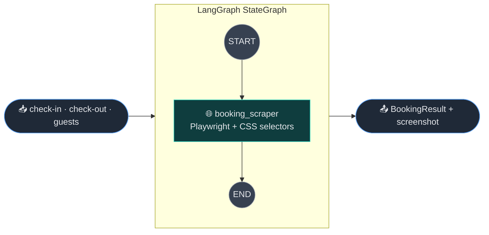
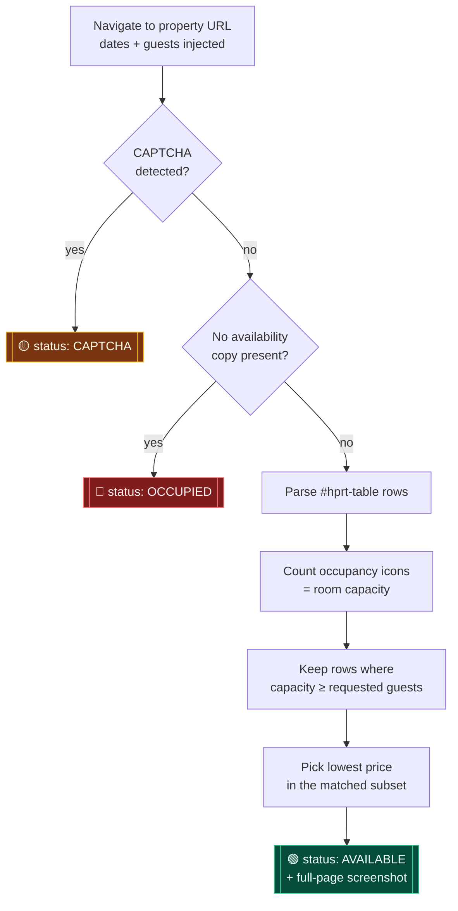
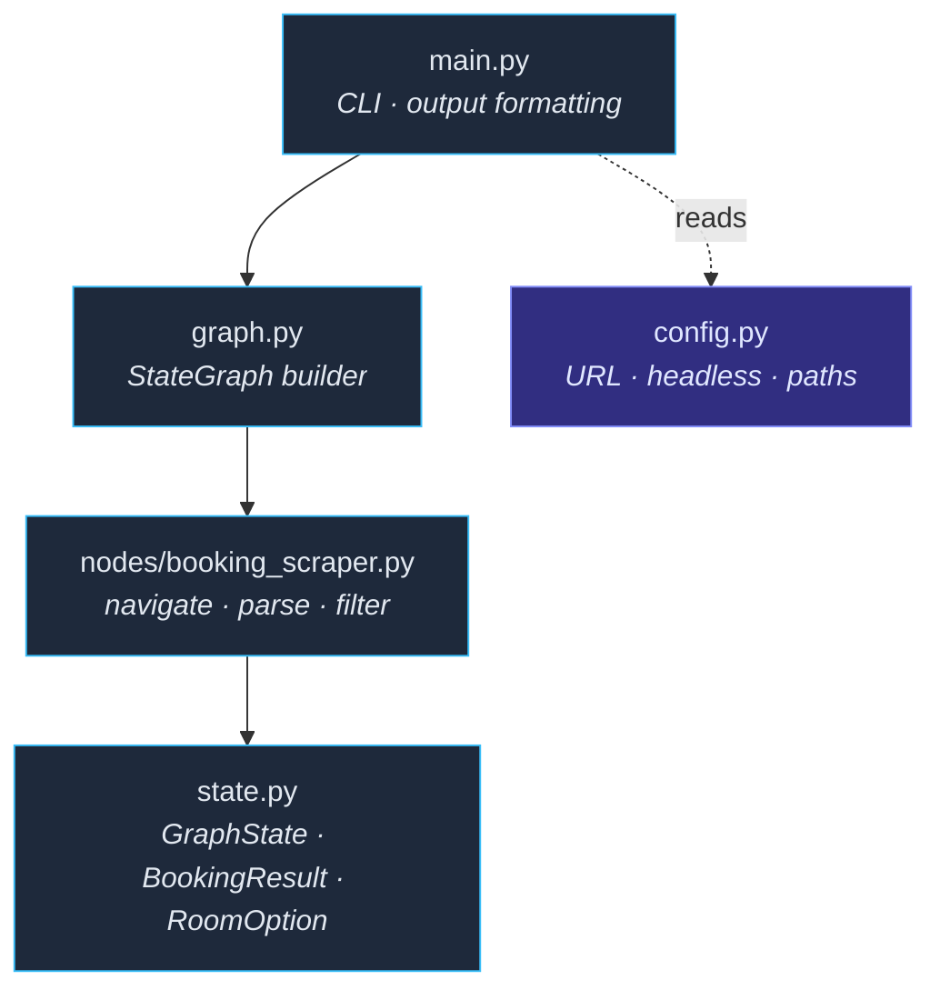
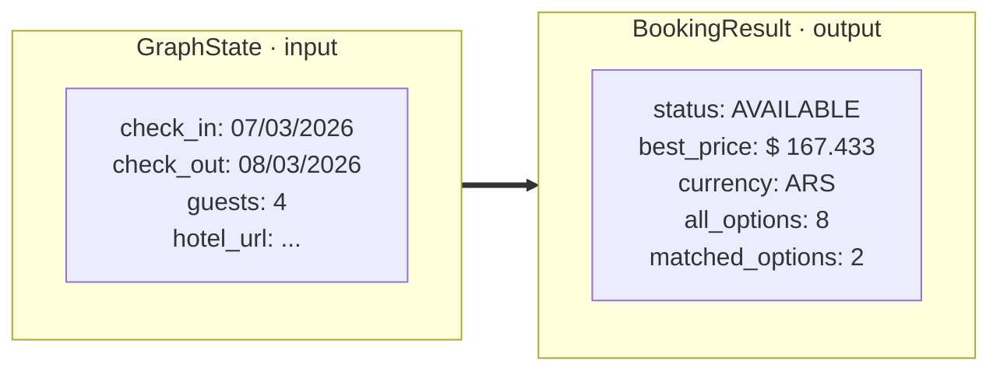

<div align="center">

# 🏨 Agente-Book

### Booking.com Price Auditor — a deterministic LangGraph agent

**Extracts the *correct* price for a given party size, classifies availability, and saves visual proof — in ~10 s, fully local, $0 API cost.**

[](https://python.org)
[](https://playwright.dev)
[](https://github.com/langchain-ai/langgraph)
[](https://docs.pydantic.dev)
[](LICENSE)

**English** · [Español](README.es.md)

</div>

---

## Why this exists

Independent hotels live and die by their pricing relative to the competition, but Booking.com gives owners **no easy way to monitor a rival's live rates** for a specific date and party size. Doing it by hand means opening the site, picking dates, counting how many guests each room sleeps, and reading the price off the table — every single day.

Agente-Book automates that audit. Point it at any Booking.com property and it returns a structured result you can act on: the best price **for the requested number of guests** (not the misleading "from $X" headline), every available room option, the availability status, and a timestamped screenshot as proof.

It started as an LLM browser-agent and was deliberately re-engineered into a deterministic scraper after the LLM version proved too slow and unreliable — see the [Engineering Log](#-engineering-log). **That decision is the point of the project: knowing when *not* to use an LLM.**

> **Target property:** any Booking.com property URL works — set it in `config.py`.

---

## 🧭 How It Works



The orchestration is a LangGraph `StateGraph`. Today it's a single node, but the graph is the architecture: alerts, multi-hotel comparison, and price history each drop in as new nodes without touching the existing one.

### Detection logic



---

## ✨ Key Features

| Feature | Description |
|---------|-------------|
| 🎯 **Capacity-aware pricing** | Returns the correct price for the requested party size — not the global minimum that sleeps fewer people |
| 🚦 **State detection** | `AVAILABLE`, `OCCUPIED`, `CAPTCHA`, `ERROR` with deterministic logic |
| 📸 **Visual evidence** | Timestamped full-page screenshot saved for every run |
| 🧩 **Extensible graph** | LangGraph `StateGraph`: add nodes (alerts, multi-hotel compare, history) without touching existing code |
| 📊 **Full option breakdown** | Returns both `all_options` and `matched_options` as structured Pydantic data |
| 💸 **Zero LLM, zero cost** | Direct Playwright + CSS selectors. No API keys, no VRAM, no per-query cost |
| ⚡ **~10 s/query** | vs ~10 min with the original LLM-agent version (see Engineering Log) |

---

## 🏗️ Architecture



**Data flow:**



---

## 🛠️ Tech Stack

| Layer | Technology | Purpose |
|-------|-----------|---------|
| **Scraping** | Playwright | Browser automation, navigation, screenshots |
| **Orchestration** | LangGraph | State graph, multi-node extensibility |
| **Data models** | Pydantic 2.x | Validation & serialization of results |
| **Parsing** | CSS selectors + regex | Price/capacity extraction from the DOM |
| **Runtime** | Python 3.11+ | Native async/await |

---

## 🚀 Getting Started

```bash
git clone https://github.com/msemino/agente-book.git
cd agente-book

pip install -r requirements.txt
python -m playwright install chromium
```

Edit `config.py` to point at any property:

```python
HOTEL_URL = "https://www.booking.com/hotel/ar/example-hotel.es.html"
HEADLESS = False   # False to watch the browser, True for production
```

No API keys or `.env` required — everything runs locally.

---

## ▶️ Usage

```bash
# Default dates (tomorrow → day after), 2 guests
python main.py

# Specific dates and party size
python main.py --checkin 07/03/2026 --checkout 08/03/2026 --guests 4

# Only render the LangGraph diagram
python main.py --graph
```

| Flag | Default | Description |
|------|---------|-------------|
| `--checkin` | tomorrow | Check-in date (dd/mm/yyyy) |
| `--checkout` | day after | Check-out date (dd/mm/yyyy) |
| `--guests` | 2 | Number of guests |
| `--graph` | – | Render the LangGraph diagram and exit |

---

## 📤 Output Examples

> Representative run (example property, Feb 2026). Live prices vary.

```
[*] Querying target property...
    Check-in:  07/03/2026
    Check-out: 08/03/2026
    Guests:    4

[+] Status: AVAILABLE
[+] Best price for 4 guests: $ 167.433 ARS
[+] Options for 4+ guests:
      4 guests -> $ 167.433
      4 guests -> $ 200.919
[*] All options:
      4 guests -> $ 167.433
      3 guests -> $ 159.061
      2 guests -> $ 150.690
      1 guest  -> $ 142.318
[+] Screenshot: evidencias/audit_20260216_090609.png
```

<details>
<summary><b>Structured result (<code>BookingResult</code> JSON)</b></summary>

```json
{
  "status": "AVAILABLE",
  "best_price": "$ 167.433",
  "currency": "ARS",
  "all_options": [
    {"guests_max": 4, "price_text": "$ 167.433", "price_value": 167433},
    {"guests_max": 4, "price_text": "$ 200.919", "price_value": 200919},
    {"guests_max": 3, "price_text": "$ 159.061", "price_value": 159061},
    {"guests_max": 2, "price_text": "$ 150.690", "price_value": 150690},
    {"guests_max": 1, "price_text": "$ 142.318", "price_value": 142318}
  ],
  "matched_options": [
    {"guests_max": 4, "price_text": "$ 167.433", "price_value": 167433},
    {"guests_max": 4, "price_text": "$ 200.919", "price_value": 200919}
  ]
}
```

</details>

---

## 🧩 Extending the Graph

The graph is linear today (`START → booking_scraper → END`). Adding a node is three steps:

**1. Create the node in `nodes/`:**

```python
# nodes/price_alert.py
from state import GraphState

async def price_alert_node(state: GraphState) -> GraphState:
    """Fire an alert when the matched price drops below a threshold."""
    br = state.get("booking_result")
    if br and br.matched_options:
        best = min(br.matched_options, key=lambda o: o.price_value)
        if best.price_value < 150000:
            ...  # notify
    return state
```

**2. Wire it in `graph.py`:**

```python
builder.add_node("price_alert", price_alert_node)
builder.add_edge("booking_scraper", "price_alert")
builder.add_edge("price_alert", END)
```

**3. Add any new fields to `GraphState` in `state.py`.**

| Candidate node | Function |
|------|----------|
| `price_comparator` | Compare live rates across competing hotels |
| `price_history` | Persist to SQLite and detect trends over time |
| `alert_telegram` | Push a notification on availability or price drop |
| `multi_date_scan` | Scan a date range in parallel |

---

## 🧠 Engineering Log

The most useful part of this project is the decision to **drop the LLM**:

| Version | Change | Result |
|---------|--------|--------|
| **v1.0** | `browser-use` + `ChatOllama` (gemma3:27b) | OOM on 24 GB GPU (27b + vision > 24 GB VRAM) |
| **v1.1** | Switched to gemma3:12b | Worked, but ~10 min/query and prone to looping |
| **v2.0** | Direct Playwright, no LLM | ~10 s/query, deterministic, 0 VRAM |
| **v2.1** | Capacity filtering + full-page screenshot | Correct price per party size, complete evidence |

> **Takeaway:** an LLM agent was the wrong tool for a structured, repeatable extraction task. A deterministic scraper is ~60× faster, free to run, and 100% reproducible. LangGraph stays because the *orchestration* value — composable nodes for alerts, comparison, history — is real even without an LLM in the loop.

---

## 🗺️ Roadmap

The graph is designed so an LLM can be reintroduced **only where it adds value** — e.g. a reasoning node for buy/no-buy decisions or trend analysis over price history. At that point the structured run traces become training data, and the LangGraph topology is directly compatible with RL / prompt-optimization tooling such as [Microsoft Agent-Lightning](https://github.com/microsoft/agent-lightning) (native LangGraph support: APO + RL + SFT).

---

<div align="center">
<sub>Built in the 24 GB GPU home AI lab · Authored with the help of Claude Code</sub>
</div>
